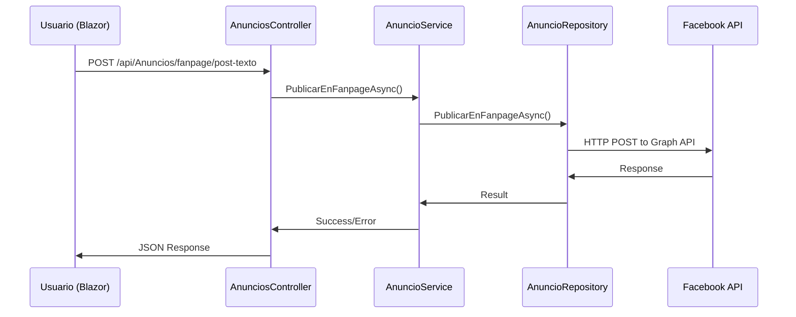

# 🏛️ Arquitectura del Proyecto

Este documento describe la arquitectura y patrones de diseño utilizados en ApiFacebookMeta.

## 📐 Visión General de la Arquitectura

ApiFacebookMeta sigue los principios de **Clean Architecture** (Arquitectura Limpia) y **Domain-Driven Design (DDD)**, organizando el código en capas bien definidas con responsabilidades específicas.

```
┌─────────────────────────────────────────────────────────────┐
│                    PRESENTACIÓN                             │
├─────────────────────────────────────────────────────────────┤
│  API Controllers   │          Blazor Web App                │
│                   │                                         │
│  • AnunciosController      • PublicarPost.razor            │
│  • FacebookAuthController • Facebook.razor                 │
│                   │        • FacebookUpload.razor          │
└─────────────────────────────────────────────────────────────┘
                              │
                              ▼
┌─────────────────────────────────────────────────────────────┐
│                    APLICACIÓN                               │
├─────────────────────────────────────────────────────────────┤
│              Services (Lógica de Negocio)                   │
│                                                             │
│  • AnuncioService                                          │
│  • FacebookAuthAppService                                  │
│                                                             │
└─────────────────────────────────────────────────────────────┘
                              │
                              ▼
┌─────────────────────────────────────────────────────────────┐
│                     DOMINIO                                 │
├─────────────────────────────────────────────────────────────┤
│    Entities          │           Contracts                  │
│                     │                                       │
│  • Anuncio          │  • IAnuncioRepository                │
│  • FanPage          │  • IFacebookAuthRepository           │
│  • Category         │                                      │
│                     │                                       │
└─────────────────────────────────────────────────────────────┘
                              │
                              ▼
┌─────────────────────────────────────────────────────────────┐
│                  INFRAESTRUCTURA                            │
├─────────────────────────────────────────────────────────────┤
│               Repository (Acceso a Datos)                   │
│                                                             │
│  • AnuncioRepository                                       │
│  • FacebookAuthRepository                                  │
│                                                             │
│  → Facebook Graph API                                      │
│  → Marketing API                                           │
│                                                             │
└─────────────────────────────────────────────────────────────┘
```

## 🏗️ Descripción de Capas

### 1. 🖥️ Capa de Presentación

**Responsabilidad**: Manejar la interacción con usuarios y sistemas externos.

#### API Controllers (`Api/`)
- **AnunciosController**: Endpoints para gestión de anuncios y publicaciones
- **FacebookAuthController**: Endpoints para autenticación y tokens

#### Blazor Web App (`WebFacebookAuth/`)
- **Components/Pages/**: Páginas interactivas para usuarios
- **SessionState**: Gestión del estado de sesión
- **Program.cs**: Configuración de la aplicación web

### 2. ⚙️ Capa de Aplicación (`Aplicacion/`)

**Responsabilidad**: Orquestar la lógica de negocio y coordinar operaciones.

#### Services
- **AnuncioService**: 
  - Lógica para crear anuncios en Facebook
  - Publicar contenido en fan pages
  - Gestión de imágenes
  
- **FacebookAuthAppService**:
  - Renovación de tokens
  - Verificación de permisos
  - Gestión de páginas de Facebook

### 3. 🏛️ Capa de Dominio (`Dominio/`)

**Responsabilidad**: Definir las reglas de negocio core y entidades del dominio.

#### Entities
```csharp
// Entidad principal para anuncios
public class Anuncio
{
    public string Id { get; set; }
    public string Nombre { get; set; }
    public long AdsetId { get; set; }
    public string CreativeId { get; set; }
    public string Estado { get; set; }
}

// Entidad para páginas de Facebook
public class FanPage
{
    public string access_token { get; set; }
    public string category { get; set; }
    public List<Category> category_list { get; set; }
    public string name { get; set; }
    public string id { get; set; }
    public List<string> tasks { get; set; }
}
```

#### Contracts (Interfaces)
- **IAnuncioRepository**: Contrato para gestión de anuncios
- **IFacebookAuthRepository**: Contrato para autenticación Facebook

### 4. 💾 Capa de Infraestructura (`Repository/`)

**Responsabilidad**: Implementar acceso a datos y servicios externos.

#### Repositories
- **AnuncioRepository**: Implementa comunicación con Facebook Marketing API
- **FacebookAuthRepository**: Implementa autenticación con Facebook Graph API

## 🔧 Patrones de Diseño Utilizados

### 1. Repository Pattern
```csharp
public interface IAnuncioRepository
{
    Task CrearAnuncioFacebookAsync(Anuncio anuncio);
    Task PublicarEnFanpageAsync(string accessTokenPage, string pageId, string mensaje);
    // ... más métodos
}

public class AnuncioRepository : IAnuncioRepository
{
    private readonly HttpClient _httpClient;
    
    // Implementación de métodos...
}
```

### 2. Dependency Injection
```csharp
// En Program.cs
builder.Services.AddScoped<AnuncioService>();
builder.Services.AddScoped<IAnuncioRepository, AnuncioRepository>();
builder.Services.AddHttpClient<AnuncioRepository>();
```

### 3. Service Layer Pattern
```csharp
public class AnuncioService
{
    private readonly IAnuncioRepository _anuncioRepository;

    public AnuncioService(IAnuncioRepository anuncioRepository)
    {
        _anuncioRepository = anuncioRepository;
    }

    public async Task PublicarEnFanpageAsync(string accessTokenPage, string pageId, string mensaje)
    {
        await _anuncioRepository.PublicarEnFanpageAsync(accessTokenPage, pageId, mensaje);
    }
}
```

### 4. DTO (Data Transfer Object) Pattern
```csharp
public class PublicarFanpageDto
{
    public required string AccessTokenPage { get; set; }
    public required string PageId { get; set; }
    public string Mensaje { get; set; }
    public string Link { get; set; }
    public string PhotoId { get; set; }
}
```

## 🔄 Flujo de Datos

### Ejemplo: Publicar un Post en Fan Page



## 📁 Estructura de Directorios

```
ApiFacebookMeta/
├── Api/                          # Capa de API
│   ├── Controllers/              # Controladores REST
│   ├── Filter/                   # Filtros para Swagger
│   └── Program.cs               # Configuración de la API
│
├── WebFacebookAuth/             # Aplicación Blazor
│   ├── Components/
│   │   └── Pages/               # Páginas Blazor
│   ├── SessionState.cs          # Estado de sesión
│   └── Program.cs               # Configuración Blazor
│
├── Aplicacion/                  # Capa de Aplicación
│   └── Services/                # Servicios de negocio
│
├── Dominio/                     # Capa de Dominio
│   ├── Entities/                # Entidades de dominio
│   └── Contracts/               # Interfaces
│
├── Repository/                  # Capa de Infraestructura
│   ├── AnuncioRepository.cs     # Repo de anuncios
│   └── FacebookAuthRepository.cs # Repo de autenticación
│
└── docs/                       # Documentación
    ├── API.md
    ├── ARCHITECTURE.md
    └── INSTALLATION.md
```

## 🔌 Configuración de Dependencias

### API Project (`Api/Program.cs`)
```csharp
// Configuración de servicios
builder.Services.AddControllers();
builder.Services.AddSwaggerGen();

// Configuración de dependencias personalizadas
builder.Services.AddHttpClient<AnuncioRepository>();
builder.Services.AddScoped<AnuncioService>();
builder.Services.AddScoped<IAnuncioRepository, AnuncioRepository>();

builder.Services.AddHttpClient<FacebookAuthRepository>();
builder.Services.AddScoped<FacebookAuthAppService>();
builder.Services.AddScoped<IFacebookAuthRepository, FacebookAuthRepository>();
```

### Blazor Project (`WebFacebookAuth/Program.cs`)
```csharp
// Servicios de Blazor
builder.Services.AddRazorComponents()
    .AddInteractiveServerComponents();

// HttpClient para comunicación con API
builder.Services.AddHttpClient("Api", client =>
{
    client.BaseAddress = new Uri("https://localhost:7296/");
});

// Estado de sesión
builder.Services.AddScoped<SessionState>();
```

## 🚀 Beneficios de esta Arquitectura

### 1. **Separación de Responsabilidades**
- Cada capa tiene una responsabilidad específica
- Fácil mantenimiento y testing

### 2. **Testabilidad**
- Interfaces permiten mock de dependencias
- Cada capa puede ser probada independientemente

### 3. **Escalabilidad**
- Fácil agregar nuevas funcionalidades
- Estructura preparada para crecimiento

### 4. **Flexibilidad**
- Fácil cambiar implementaciones (ej: cambiar de Facebook API a otra)
- Configuración externa mediante DI

### 5. **Reutilización**
- Servicios pueden ser reutilizados entre API y Blazor
- Lógica de negocio centralizada

## 🔄 Patrones de Comunicación

### Entre Capas
- **API → Service**: Inyección de dependencias
- **Service → Repository**: Interface contracts
- **Repository → External API**: HttpClient

### Manejo de Errores
- **Repository**: Captura errores de HTTP y los propaga
- **Service**: Aplica lógica de negocio para errores
- **Controller**: Devuelve códigos HTTP apropiados

### Logging
- **Configurado en Program.cs**
- **Disponible en todas las capas**
- **Centralizado para debugging**

## 🔧 Extensibilidad

### Agregar Nueva Funcionalidad

1. **Definir entidad** en `Dominio/Entities/`
2. **Crear contrato** en `Dominio/Contracts/`
3. **Implementar repository** en `Repository/`
4. **Crear service** en `Aplicacion/Services/`
5. **Agregar controller** en `Api/Controllers/`
6. **Configurar DI** en `Program.cs`

### Ejemplo: Agregar Gestión de Eventos de Facebook

```csharp
// 1. Entidad
public class FacebookEvent
{
    public string Id { get; set; }
    public string Name { get; set; }
    public DateTime StartTime { get; set; }
}

// 2. Contrato
public interface IEventRepository
{
    Task<List<FacebookEvent>> GetEventsAsync(string pageId);
    Task<FacebookEvent> CreateEventAsync(FacebookEvent evento);
}

// 3. Repository
public class EventRepository : IEventRepository
{
    // Implementación...
}

// 4. Service
public class EventService
{
    private readonly IEventRepository _eventRepository;
    
    // Lógica de negocio...
}

// 5. Controller
[ApiController]
[Route("api/[controller]")]
public class EventsController : ControllerBase
{
    // Endpoints...
}
```

Esta arquitectura proporciona una base sólida y escalable para el desarrollo continuo del sistema de integración con Facebook Meta.